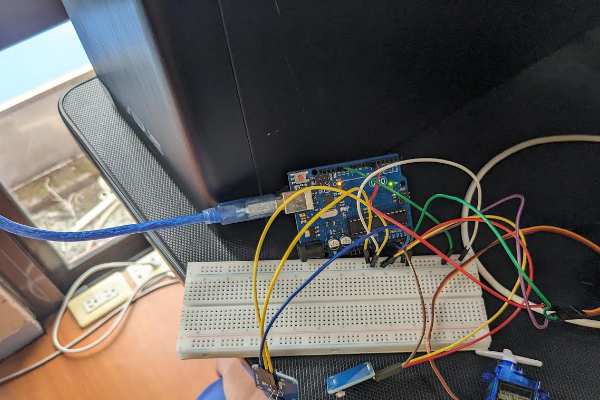
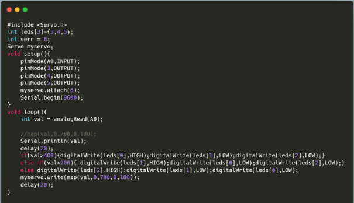

# 高三上 科技應用專題課程：使用 Arduino 開發板與 C++ 模擬電動車

## 學習目的

- 認識 Arduino Uno 開發板、IDE、函式庫與麵包板電路設計。
- 練習將結果統整成一份可讀性高的報告。

## 學習成果

### Github 內容： <br>

[原始碼](./final/)  

### 課程照片




## 學習心得與未來展望

### 學習心得

由於在國中時期便開始接觸 Arduino 相關的獨立研究，我對電路與 Arduino 已經駕輕就熟。本學期的課程過程共有以下數點是我印象深刻、得到省思的事件：

#### 電阻與電路

電路設計在高中通常只有物理課才會稍微提到，在實際操作與認識之後，我對電路設計有了更多瞭解。

#### 倒車輔助與 delay() 函式

在程式 [`reverse(car).ino`](./final/reverse(car).ino) 內，老師的範例本來使用了以下方式處理倒車期間*beep*聲的停頓：

```C++
void beep(int a){
    digitalWrite(7,HIGH);
    delay(a);
    digitalWrite(7,LOW);
    delay(a);
  }
```

但是 [Arduino 官方文件](https://www.arduino.cc/reference/en/language/functions/time/delay/) 中指出 `delay()` 會完全停止程式運作，而在這個狀況下，其他的輸入也將不會執行。在倒車的情景下，這樣的停頓可能導致偵測距離過程的延遲。並不適合使用這種模式。
<br>

於是官方文件提出以 `millis()` 函式與判斷式處理這個狀況。我在思考後，使用了這個方式改善：

```C++
void beep1(int a){
    if(millis()-nowTime>a){
    digitalWrite(7,HIGH);
    beepFlag=!beepFlag;
    }
    if(millis()-nowTime>a){
    digitalWrite(7,LOW);
    beepFlag=!beepFlag;
    }
```

在這個函式中，程式便不會因為需要停頓而發生上述的安全疑慮。

### 未來展望

由於自動駕駛技術在現代已經逐漸被應用在更多、更重要的地方，我希望在這項有風險的技術中將可能發生的意外減少。
