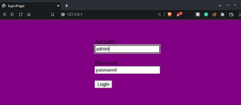
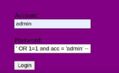
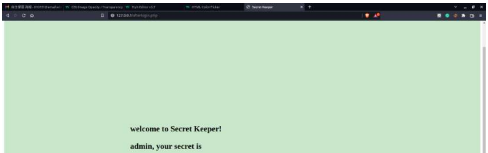

# 高一下學期自主學習成果報告

## 初探資安與網站

學習成員：謝昕倫、蔡冠毅

>此資料為**高三**重新回顧後，再整理的學習資料。

### 前言

資訊安全的重要性以及疏忽的嚴重後果在2020後的世界有非常多的案例可循。為了瞭解更多與其相關的知識以及防範方法，我們決定以實際操作一次攻擊作為踏入資訊安全領域的一個契機，認識並熟悉工具、學習資源與社群。

### 研究概要

為達成探索目的，我們自行架設網站，模擬可能發生的攻擊並瞭解防禦手段。此外，研究過程使用了 Manjaro 作為研究平台，同時熟悉了在常見環境下，操作資料庫、網頁伺服器的方式。

### 研究方法

1. 安裝 Manjaro  
使用 Manjaro 的原因是其對初學者較友好的安裝過程及易學習的桌面環境。在許多網頁推薦下選用了此發行版。
2. 架設伺服器、撰寫程式 
本次研究使用Apache Web Server搭配 php 及 mySQL ，使網頁的運作並架設假定的攻擊環境。
3. 攻擊實作 
於同一機器上開啟本機地址，並直接測試網頁運作以及攻擊實作。

 

`這是正常的登入畫面`

 

`這是使用注入攻擊時的登入畫面`

 

`兩者皆能完成登入`

 

### 問題解決的學習

研究過程中，最痛苦的是對於環境的熟悉與尋找解答的過程。以下是兩個實際遭遇的問題，充分刻畫出在學習路上會經歷的問題們。

+ *PHP 程式被瀏覽器直接印出*   此問題係因 Apache HTTP Server 並未預設支援 PHP 程式，我們先是檢查了各項伺服器運作的過程與程式碼，確認無誤卻都沒有找到原因，爾後在搜尋 PHP 程式的學習網頁時才偶然解決。本次經驗帶給我們兩項須知：仔細閱讀過所使用的軟、硬體資料，才能夠在使用前便有基礎，不致慌亂而盲目嘗試，浪費研究時間。另外，網路上玲瑯滿目的教學文件須謹慎使用，日期久遠或不可信的來源可能會讓事情更糟糕。

+ *時不時產生的 HTTP500 錯誤*   此問題本身並無太多困難的成分，只是程式碼出了錯，但在檔案與程式碼逐漸變多的過程中，完全沒有自行觀察以外的方法讓偵錯變得十分困難。在查詢論壇(此時的我們發現了讀文件外的第二選擇)的相關問題後，得知偵錯函式的存在。明確表達的錯誤訊息加快了我們的執行進度

### 收穫與思考  

+ *沒有指導者後，學習的心態與方式*   從架設平台、撰寫程式到最後的測試，所有的資料與教學都只能從深不見底的網路中探尋。部分網頁又包含已經不再正確的資訊，造成不懂檢驗的我們不停犯錯。在幾次出錯後，我們開始學會用精準的關鍵字、謹慎的查證心態作為學習實的基礎心態，而這樣的心態，也讓接著參加競賽與檢定的自學路更加順暢。 
+ *探索要有計畫，但計畫之外的事情也不必排斥*   撰寫計畫書時，我們並沒有任何學習的概念，只是填上可能需要用到的工具名稱就交差了事。於是，我們在探索的途中開始遭遇五花八門的奇異現象：終端機指令執行不如預期、系統權限的管理、網頁元素、伺服器與網路裝置間的互動等有趣的問題與現象在每次學習與執行時出現，我們因此間接得到更多意料外的、實用的觀念和能力。探索前，我們應該更加清楚的了解、訂下合宜的計劃表，盡力執行。但若是時間情況允許，像本次經驗的額外學習機會卻也不應該錯過。 

+ *瞭解、解決、並且預防問題*   在發現一項無法解決的問題時，過去的我們只懂得盲目地用沒有效率的搜尋、描述尋求解方。但在本次學習後，我們學到發問、求學的注意事項，如詳細的問題描述、用 paste bin 一類工具紀錄錯誤以供他人檢閱以及發問的禮儀等。也漸漸瞭解問題可能發生的原因及特徵，逐漸摸索出不必求於他人也能解決問題的能力。
